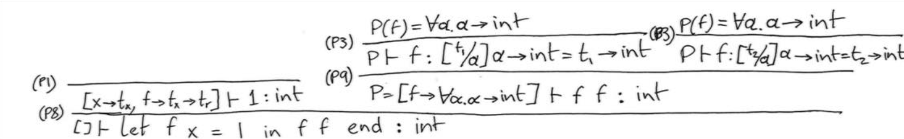
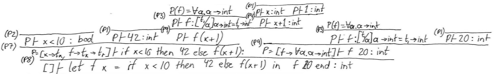

# BPRD-05

Here, we will provide all our answers, and in which files they are answered.

## Exercise 5.1

The merge function in both `F#` and `Java`. Found in `Merge.fsx` and `Merge.java`.

```fsharp
// Manually sorting
let merge (lst1: int list, lst2: int list) =
    let rec aux lst1 lst2 acc =
        match (lst1: int list), (lst2: int list) with
        | (x :: xs), (y :: ys) when x > y -> aux (x :: xs) ys (acc @ [y])
        | (x :: xs), (y :: ys) -> aux xs (y :: ys) (acc @ [x])
        | (x :: xs), [] -> aux xs [] (acc @ [x])
        | [], (y :: ys) -> aux [] ys (acc @ [y])
        | [], [] -> acc
    aux lst1 lst2 []

// Using List.sort
let merge2 (xs, ys) =
    List.sort (xs @ ys)

let xs = [3; 5; 12]
let ys = [2; 3; 4; 7]

merge (xs, ys)
```

```java
import java.util.Arrays;

public class Merge {
    public static void main(String[] args) {
        int[] xs = { 3, 5, 12 };
        int[] ys = { 2, 3, 4, 7 };
        System.out.println(Arrays.toString(xs));
        System.out.println(Arrays.toString(ys));
        System.out.println(Arrays.toString(merge(xs, ys)));
    }

    static int[] merge(int[] xs, int[] ys) {
        int[] orderedLst = new int[xs.length + ys.length];

        for (int i = 0; i < xs.length; i++)
            orderedLst[i] = xs[i];

        for (int i = 0, lstCounter = xs.length; i < ys.length; i++, lstCounter++)
            orderedLst[lstCounter] = ys[i];

        Arrays.sort(orderedLst);
        
        return orderedLst;
    }
}
```

## Exercise 5.7

Found in `TypedFun.fs`.

**Successful examples:**

```fsharp
(* Exercise 5.7 examples*)
let ex57_1 = ListExp ([CstI 1; CstI 2], TypI)
> typeCheck ex5_7_1;;
val it: typ = TypL TypI
```

```fsharp
let ex57_2 = ListExp ([
                Letfun("inf", "x", TypI, Call(Var "inf", Var "x"), TypI, Call(Var "inf", CstI 0));
                Letfun("inf", "x", TypI, Call(Var "inf", Var "x"), TypI, Call(Var "inf", CstI 1))
                ], TypI)
> typeCheck ex5_7_2;;
val it: typ = TypL TypI
```

**Failing examples:**

```fsharp
let ex57_3 = ListExp ([CstB true; CstI 1], TypB)
> typeCheck ex57_2;;
System.Exception: Type error: 1 elements do not match list type.
   at FSI_0002.TypedFun.typ(tyexpr e, FSharpList`1 env) in /home/faur/Programming/ITU/5th_Semester/PRDAT/BPRD-05/Fun2/TypedFun.fs:line 149
   at <StartupCode$FSI_0004>.$FSI_0004.main@() in /home/faur/Programming/ITU/5th_Semester/PRDAT/BPRD-05/stdin:line 2
Stopped due to error
```

```fsharp
let ex57_4 = ListExp ([CstB true; CstB false], TypI)
> typeCheck ex57_5;;
System.Exception: Type error: 1 element(s) do not match list type.
   at FSI_0002.TypedFun.typ(tyexpr e, FSharpList`1 env) in /home/faur/Programming/ITU/5th_Semester/PRDAT/BPRD-05/Fun2/TypedFun.fs:line 149
   at <StartupCode$FSI_0007>.$FSI_0007.main@() in /home/faur/Programming/ITU/5th_Semester/PRDAT/BPRD-05/stdin:line 5
Stopped due to error
```

```fsharp
let ex57_5 = ListExp ([
                Letfun("inf", "x", TypI, Call(Var "inf", Var "x"), TypB, Call(Var "inf", CstI 0));
                Letfun("inf", "x", TypI, Call(Var "inf", Var "x"), TypI, Call(Var "inf", CstI 1))
                ], TypI)
> typeCheck ex57_5;;
System.Exception: Type error: 1 element(s) do not match list type.
  at FSI_0002.TypedFun.typ(tyexpr e, FSharpList`1 env) in /home/faur/Programming/ITU/5th_Semester/PRDAT/BPRD-05/Fun2/TypedFun.fs:line 149
  at <StartupCode$FSI_0007>.$FSI_0007.main@() in /home/faur/Programming/ITU/5th_Semester/PRDAT/BPRD-05/stdin:line 5
Stopped due to error
```

## Exercise 6.1

Found in `ParseAndRunHigher.fs`.

```fsharp
let ex10 = 
    fromString
        @"let add x = let f y = x+y in f end
        in add 2 5 end"

> run ex10;;
val it: HigherFun.value = Int 7

let ex11 =
    fromString
        @"let add x = let f y = x+y in f end
        in let addtwo = add 2
            in addtwo 5 end
        end"

> run ex11;;
val it: HigherFun.value = Int 7

let ex12 =
    fromString
        @"let add x = let f y = x+y in f end
        in let addtwo = add 2
            in let x = 77 in addtwo 5 end
            end
        end"

// Expected: 7 due to the 'let x = 77' being overwritten by the add function.
> run ex12;;
val it: HigherFun.value = Int 7

let ex13 =
    fromString
        @"let add x = let f y = x+y in f end
        in add 2 end"

// Explain: This returns a partial application function that waits for the y 
//          parameter in the function f. 

> run ex13;;
val it: HigherFun.value =
  Closure
    ("f", "y", Prim ("+", Var "x", Var "y"),
     [("x", Int 2);
      ("add",
       Closure
         ("add", "x", Letfun ("f", "y", Prim ("+", Var "x", Var "y"), Var "f"),
          []))])
```

## Exercise 6.2

Found in `Absyn.fs` and `Fun.fs`.

## Exercise 6.3

Found in `FunLex.fsl`, `FunPar.fsy` and `ParseAndRunHigher.fs`.

```fsharp
let ex16 = 
    fromString
        @"let add x = fun y -> x+y
        in add 2 5 end"

> run ex16;;
val it: HigherFun.value = Int 7

let ex17 = 
    fromString
        @"let add = fun x -> fun y -> x+y
        in add 2 5 end"

> run ex17;;
val it: HigherFun.value = Int 7
```

## Exercise 6.4





## Exercise 6.5

Found in `ParseAndType.fs`. 

### Part 1

```fsharp
let ex6_5_1 = 
    (fromString "let f x = 1 
                 in f f end");;

> inferType ex6_5_1;;
val it: string = "int"
```

**Exercise 6.5(2)**: The function results in a type error: circularity. This is due it depends on the function `g` which has no type.

```fsharp
let ex6_5_2 = 
    (fromString "let f g = g g 
                 in f end");;

> inferType ex6_5_2;;
System.Exception: type error: circularity
```

```fsharp
let ex6_5_3 = 
    (fromString "let f x =
                    let g y = y
                    in g false end
                 in f 42 end");;
                          
> inferType ex6_5_3;;
val it: string = "bool
```

**Exercise 6.5(4)**: Here, the function `f` returns both `bool` and `int`. This is not typable.

```fsharp
let ex6_5_4 = 
    (fromString "let f x =
                    let g y = if true then y else x
                    in g false end
                 in f 42 end");;

> inferType ex6_5_4;;
System.Exception: type error: bool and int
```

```fsharp
let ex6_5_5 = 
    (fromString "let f x =
                    let g y = if true then y else x
                    in g false end
                 in f true end");;

> inferType ex6_5_5;;
val it: string = "bool"
```

### Part 2

**Exercise 6.5(1)**: `bool -> bool`.

```fsharp
let ex6_5_6 =
    (fromString "let f x = if x = true then true else false in f end");;

> inferType ex6_5_6;;
val it: string = "(bool -> bool)"
```

**Exercise 6.5(2)**: `int -> int`.

```fsharp
let ex6_5_7 =
    (fromString "let f x = if x = 1 then 2 else 3 in f end");;

> inferType ex6_5_7;;
val it: string = "(int -> int)"
```

**Exercise 6.5(3)**: `int -> int -> int`.

```fsharp
let ex6_5_8 =
    (fromString "let f x = 
                    let g y = x + y
                    in g end
                 in f end");;

> inferType ex6_5_8;;
val it: string = "(int -> (int -> int))"
```

**Exercise 6.5(4)**: `'a -> 'b -> 'a`.

```fsharp
let ex6_5_9 =
    (fromString "let f x = 
                    let g y = x
                    in g end
                 in f end");; 

> inferType ex6_5_9;;
val it: string = "('h -> ('g -> 'h))"
```

**Exercise 6.5(5)**: `'a -> 'b -> 'b`.

```fsharp
let ex6_5_10 =
    (fromString "let f x = 
                    let g y = y
                    in g end
                 in f end");;

> inferType ex6_5_10;;
val it: string = "('g -> ('h -> 'h))"
```

**Exercise 6.5(6)**: `('a -> 'b) -> ('b -> 'c) -> ('a -> 'c)`.

```fsharp
let ex6_5_11 =
    (fromString "let f x =
                    let g y = 
                        let h z = y (x z) in h end
                    in g end
                in f end");;

> inferType ex6_5_11;;
val it: string = "(('l -> 'k) -> (('k -> 'm) -> ('l -> 'm)))"
```

**Exercise 6.5(7)**: `'a -> 'b`.

```fsharp
let ex6_5_12 =
    (fromString "let f x = let g = f x in g end
                 in f end");;

> inferType ex6_5_12;;
val it: string = "('e -> 'f)"
```

**Exercise 6.5(8)**: `'a`.

```fsharp
let ex6_5_13 =
    (fromString "let f x = f 1 in f 4 end");;

> inferType ex6_5_13;;
val it: string = "'e"
```
